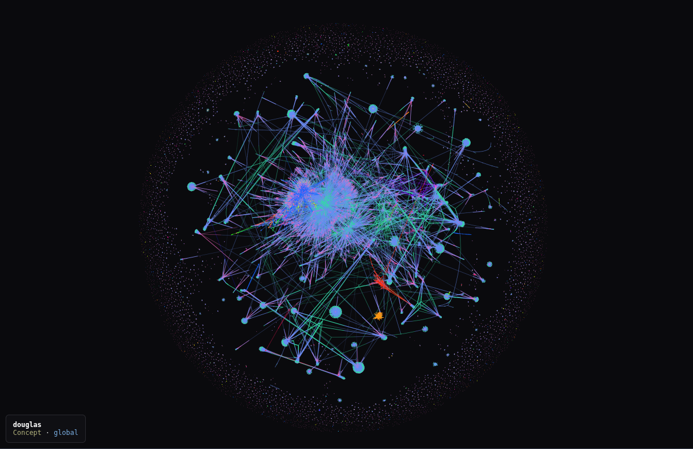
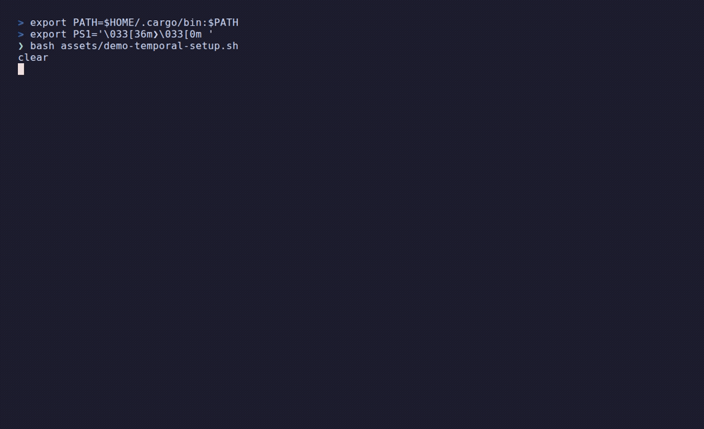

# c0

**An external memory for LLMs** — a bi-temporal knowledge graph with hybrid (keyword + vector) retrieval and a self-improving reflection loop.



[](https://github.com/douglasjordan2/c0/actions/workflows/ci.yml)
[](./LICENSE)
[](https://www.rust-lang.org/)

---

## Why

Language models are **stateless between sessions** and their training data **goes stale**. The usual fix — stuffing documents into a vector store — retrieves blobs of prose and has no notion of how knowledge changes over time.

c0 takes a different approach. It stores knowledge as a **graph of concepts and the relationships between them**, retrieves the relevant subgraph on demand, and tracks how each fact evolves. The result is a persistent, *correctable* memory layer you can query in natural language and grow as you work.

## How it works

```
query ──▶ ❶ exact match ─▶ ❷ keyword (BM25) ─▶ ❸ hybrid (BM25 + vector, fused by RRF)
                                                          │
                                                          ▼
                                          resolve to a concept node in Neo4j
                                                          │
                                                          ▼
                                     traverse the graph for related context  ──▶  answer
                                                          │
                                              (no match) ▼
                                          reflection loop: learn from the miss
```

- **Graph storage (Neo4j).** Knowledge lives as `Concept` nodes and typed relationships, not as text chunks — so retrieval can *traverse* from one idea to related ones.
- **Hybrid retrieval.** A tiered cascade: exact match → keyword (Lucene/BM25) → **hybrid**, which runs keyword *and* vector search and merges them with **Reciprocal Rank Fusion (RRF)**. Keyword nails exact names and identifiers; vectors catch synonyms and paraphrase; fusion gets the best of both without normalizing incompatible score scales.
- **Bi-temporal.** Every concept carries two independent timestamps — when it was *recorded* (transaction time) and when it is *true* (valid time) — so you can run point-in-time ("as-of") queries, **supersede** a concept when it evolves, or **invalidate** it with a causal audit trail. Nothing is deleted; it's time-bounded.
- **Self-improving reflection loop.** When a lookup finds nothing, the dead end is queued, and an LLM classifies it: **commit** a genuinely new, reusable concept, **discard** noise, or **queue** the uncertain ones for human review. Run it continuously (`c0 reflector run`) and c0 fills its own memory gaps as you work — [details below](#the-reflection-loop--c0s-learning-engine).

## See it in action

**Correct stale training data.** A pre-2026 model insists you create a Shopify app in Admin → "Develop apps". c0 walks its graph and overrides that with a patch — current knowledge wins.


**Hybrid retrieval — keyword + vector, fused by RRF.** One paraphrased question, three ways: keyword (BM25) misses it, vector understands intent, hybrid fuses both.


**Bi-temporal — ask "as of" any point in time.** The same question returns the era-correct answer: the Pages Router in 2022, the App Router today, with a dated supersession trail.



**Self-improving — a dead end becomes a new concept.** A lookup misses, the reflection loop classifies it, and c0 commits the new knowledge to its own graph — no human in the loop.


## Requirements

- **Rust** (2024 edition — 1.85+)
- **Neo4j 5** — a `docker-compose.yml` is included
- **[Ollama](https://ollama.com/)** for local embeddings *and* the reflection loop's classifier (defaults: `nomic-embed-text` for embeddings, `hermes3:8b` for classification) — the whole loop runs locally, no key required
- *(optional)* an **Anthropic API key** — opt in with `[claude] enabled = true` to use Claude instead of a local model for classification/extraction (higher quality, at cost)

## Quickstart

```bash
# 1. Start Neo4j (binds to localhost only)
docker compose up -d

# 2. Pull the embedding model
ollama pull nomic-embed-text

# 3. Build & install
cargo install --path .

# 4. Point c0 at Neo4j (defaults shown; the bundled compose uses no auth)
export NEO4J_URI="bolt://localhost:7687"
export NEO4J_USER=""        # empty for the bundled docker-compose
export NEO4J_PASSWORD=""
# export ANTHROPIC_API_KEY="sk-..."   # optional; only for [claude] enabled = true (defaults are local Ollama)

# 5. Create indexes (vector + fulltext), then a namespace
c0 migrate
c0 init --namespace my-project

# 6. Add knowledge and recall it
c0 add concept "reciprocal rank fusion" -d "Rank-based fusion of multiple result lists; score = weight/(k+rank)."
c0 add concept "hybrid search" -d "Keyword (BM25) + vector retrieval, fused by RRF." --force
c0 relate "reciprocal rank fusion" USED_BY "hybrid search"   # both endpoints must exist
c0 walk "reciprocal rank fusion"                             # traverses outgoing edges -> "hybrid search"
```

> `--force` on the second concept skips the *similar-concept* guard: closely related ideas
> often score as near-duplicates, and `relate` requires both endpoints to already exist.

## Core commands

| Command | What it does |
|---|---|
| `c0 walk <topic>` | Recall: resolve a concept (exact → keyword → hybrid) and traverse for context |
| `c0 walk <topic> --as-of <date>` | Point-in-time recall (bi-temporal) |
| `c0 search <query>` | Hybrid search without traversal (`--vector-only` / `--keyword-only`) |
| `c0 add concept <name> -d "<desc>"` | Add a concept (embedded on write) |
| `c0 add patch <name> --content "<text>"` | Add a knowledge patch that corrects/augments a concept |
| `c0 relate <a> <TYPE> <b>` | Create a typed relationship |
| `c0 supersede <old> --with <new>` | Mark a concept evolved into a newer one |
| `c0 invalidate concept <name> --reason "<why>"` | Retract a concept with a causal trail |
| `c0 describe <concept> "<new desc>"` | Update a description (and re-embed) |
| `c0 reflector run` | Run the learning loop: classify dead ends → commit new concepts (see [below](#the-reflection-loop--c0s-learning-engine)) |
| `c0 health --fix` | Check Neo4j / Ollama / indexes |
| `c0 export` · `c0 audit` · `c0 move` | Maintenance utilities |

Run `c0 --help` for the full set.

## Configuration

c0 reads connection details from the environment, with a per-namespace `.c0/config.toml` for local settings:

| Variable | Default | Purpose |
|---|---|---|
| `NEO4J_URI` | `bolt://localhost:7687` | Neo4j connection |
| `NEO4J_USER` / `NEO4J_PASSWORD` | empty | Neo4j auth |
| `ANTHROPIC_API_KEY` | — | Optional; used only when `[claude] enabled = true`. By default, classification & extraction run on a local Ollama model — no key needed |

Embedding host/model (Ollama) default to `http://localhost:11434` and `nomic-embed-text`, and are configurable.

## Running locally (modest hardware is fine)

c0's **core recall path — `walk` / `search` / `add` — needs almost nothing.** The only moving parts are Neo4j and a single small embedding model (`nomic-embed-text`, ~140M parameters, well under 1 GB), and both run comfortably **CPU-only**. No GPU, no cloud. A few gigabytes of free RAM cover the graph, the embedder, and Neo4j's page cache for a personal-scale knowledge base.

The heavier work is **optional and runs in the background**. The reflection loop, concept extraction, and session enrichment use a chat LLM — and **by default that's a local Ollama model** (e.g. `qwen2.5:7b`/`:14b` for extraction/enrichment, `hermes3:8b` for classification), so the whole thing runs keyless and offline. Opt into the Anthropic API (`[claude] enabled = true`) only if you want Claude's higher-quality `haiku`/`sonnet` judgment. Because none of this is on the recall hot path, **CPU inference is fine** — a slow background tick never affects how fast `walk` feels.

| If you want… | You need | Notes |
|---|---|---|
| **Core recall** (walk / search / add) | CPU + ~2–4 GB free RAM | Neo4j + `nomic-embed-text`. No GPU. |
| **+ run the loop's classifier on-device** (no API key) | ~8 GB RAM for a 7B model | local `qwen2.5:7b` instead of the API; background, so CPU speed is fine |
| **Faster / higher-quality local LLM** | a GPU (optional) | ~6 GB VRAM runs the embedder + a 7B model fast; 12–24 GB unlocks 14B–32B |

The short version: the embedding hot path is light enough for any laptop, and the only reason to add a GPU is to make the *optional* local LLM work faster — never to make c0 usable in the first place.

> **On a slow CPU-only host, watch the enrichment timeout.** Recall stays fast (embeddings are tiny), but enriching a *large* session can take minutes — and if a single call exceeds the per-request timeout (default 600 s) it fails with `TimedOut`. If you hit that: raise it with `C0_ENRICH_TIMEOUT_SECS`, do less per call (`C0_ENRICH_MAX_CONCEPTS`, `C0_ENRICH_TEXT_BUDGET`, or a smaller `--limit`), or use a faster/smaller model. And if you schedule several LLM jobs (enrich, extract, the reflector), serialize them — e.g. wrap each in a shared `flock` — so they don't dogpile Ollama's single-threaded queue, where a *waiting* request still burns its timeout.

## Using c0 with Claude Code

c0 pays off most when you treat the **graph as where knowledge lives** and keep your `CLAUDE.md` for **protocol** — the instruction to consult c0, plus your own house rules. Project facts, API shapes, and architecture decisions go stale fast and bloat every prompt when hard-coded into `CLAUDE.md`; put them in the graph instead and let the model pull the relevant subgraph on demand, then *correct* it over time with patches and supersessions.

The one thing `CLAUDE.md` **does** need is an instruction to actually reach for c0. A minimal version:

```md
## Memory

Before answering questions about this project's stack, architecture, or APIs,
run `c0 walk "<topic>"` first and use what it returns — it patches stale
training knowledge. As you learn durable facts, write them back with
`c0 add concept` / `c0 relate` so the next session inherits them.
```

Keep your preferences and conventions in `CLAUDE.md` as usual — just stop hand-maintaining *knowledge* there. For hands-off recall, wire `c0 walk` into a [Claude Code hook](https://docs.claude.com/en/docs/claude-code/hooks) so the lookup happens automatically on matching prompts.

### The setup I run

The conceptual version above is enough to get value. Here's the concrete wiring I use day to day.

**1. Send memory to the graph, not to files.** Claude Code ships a built-in file memory (`memory/`, `MEMORY.md`). Run it alongside c0 and you get two unsynced stores. One rule in `CLAUDE.md` routes everything to the graph instead, where `c0 walk` can find it:

```md
## Memory → c0, not files

Don't use the built-in file memory (`memory/`, `MEMORY.md`). The graph is the only
persistent store. When you'd save a durable fact, route it to c0 —
`c0 add concept <name> -d "..."` or `c0 add patch <name> --content "..."`.
To recall, `c0 walk "<topic>"`. This rule overrides the default memory behavior.
```

**2. Three hooks make recall and reflection automatic**, so I never have to *remember* to use c0. Register them in `~/.claude/settings.json`:

```json
{
  "hooks": {
    "SessionStart":     [{ "hooks": [{ "type": "command", "command": "$HOME/.claude/hooks/c0-session-start.sh" }] }],
    "UserPromptSubmit": [{ "hooks": [{ "type": "command", "command": "$HOME/.claude/hooks/c0-memory-check.sh" }] }],
    "PostToolUse":      [{ "matcher": "Bash", "hooks": [{ "type": "command", "command": "$HOME/.claude/hooks/dead-end-reflect.sh" }] }]
  }
}
```

*`c0-memory-check.sh`* — on every prompt, ask c0 whether the topic is one it knows; if so, tell Claude to walk it **before** answering:

```bash
#!/usr/bin/env bash
input=$(cat); prompt=$(echo "$input" | jq -r '.prompt // empty')
[[ ${#prompt} -lt 15 ]] && exit 0
topic=$(c0 trigger match "$prompt" 2>/dev/null)
if [[ -n "$topic" ]]; then
  echo "🧠 Before responding, run: c0 walk \"$topic\""
  echo "   (loads memory; patches correct stale training data)"
fi
# falls back to `c0 extract-concepts` to catch known concepts no trigger covered
```

*`dead-end-reflect.sh`* — when any command prints a `DEAD_END`, classify the miss right then instead of waiting for the hourly loop:

```bash
#!/usr/bin/env bash
out=$(cat | jq -r '.tool_response.stdout // ""')
[[ "$out" == *"DEAD_END:"* ]] || exit 0
q=$(echo "$out" | sed -n 's/.*DEAD_END:[^:]*:\(.*\)/\1/p' | head -1)
[[ -n "$q" ]] && jq -n --arg q "$q" '{hookSpecificOutput:{hookEventName:"PostToolUse",
  additionalContext:("Dead end: \""+$q+"\". Classify now: commit a real concept with `c0 add concept`, queue if unsure, discard if noise.")}}'
```

*`c0-session-start.sh`* — opens a c0 session and surfaces any dead ends the previous session left unresolved, so misses don't fall through the cracks between sittings.

**3. Close the loop unattended.** The hooks *notice* gaps; the reflection loop *fills* them. Run it on a schedule — see [The reflection loop](#the-reflection-loop--c0s-learning-engine) for `c0 reflector run` and a cron/systemd setup.

> This is a workflow suggestion, not a setup requirement — c0 is a plain CLI and works with any assistant (or none). Adopt as much of the pattern as suits you.

## Optional: Claude Code session indexing

If you use [Claude Code](https://claude.com/claude-code), an optional feature indexes your session transcripts into the graph so you can semantically search past conversations and jump back into the right one. It's **off by default** (it couples to Claude Code's transcript format); enable it explicitly:

```bash
cargo install --path . --features sessions
```

This is the reference example of c0's **source-adapter** pattern — the same shape any "fill the graph from <source>" integration would take.

## The reflection loop — c0's learning engine

This is the part that makes c0 *memory* rather than a database: it learns from what it **fails** to find. Every time `c0 walk` comes up empty, that query is recorded as a dead end (`~/.c0/reflector/inbox.jsonl`). The reflection loop turns those misses into knowledge — an LLM classifies each one:

- **COMMIT** — a genuinely new, reusable concept worth adding to the graph
- **DISCARD** — noise (typos, test queries, local paths)
- **QUEUE** — uncertain; leave it for a human to judge

Run unattended, this is a flywheel: the more you use c0, the more the gaps in its memory get noticed, classified, and filled — so the *next* lookup that would have missed now hits.

### Run it (the whole point)

**The loop itself isn't optional — it's what makes c0 a memory that improves rather than a static store. What's optional is _how_ you run it.** Recall (`walk`) and reflection are the two halves of the same flywheel: one reads the graph, the other grows it. Skip the reflection half and the graph only ever holds what you typed in by hand. So the real question isn't *whether* to close the loop but *how* — and that's the part that takes tuning: too eager and it spams the graph with noise, too passive and it never learns. Pick a mechanism that fits your workflow and commit to it; everything below is just options.

The simplest is the built-in watch mode — it classifies the inbox, applies the commits, sleeps, and repeats:

```bash
c0 reflector run                      # tick every hour, auto-commit the COMMITs
c0 reflector run --interval 15m       # tick more often
c0 reflector run --no-apply           # classify only; hold COMMITs for human review
```

For an always-on, unattended setup, prefer the OS scheduler over a long-lived process — cron and systemd handle restarts and logging for you:

```cron
# Classify dead ends every hour and auto-commit. Keep a human in the loop?
# Drop the "&& c0 reflector apply" and run `c0 reflector review` when you check in.
0 * * * * c0 reflector process && c0 reflector apply
```

### Inspect and steer it

The loop is intentionally two-staged (`process` → `apply`) so nothing touches the graph until you say so:

```bash
c0 reflector status     # how many dead ends are waiting, proposed, or queued
c0 reflector process    # LLM classifies the inbox (writes pending commits + review queue)
c0 reflector proposed   # preview the concepts it wants to COMMIT
c0 reflector apply      # add the pending concepts to the graph
c0 reflector review     # walk the QUEUE'd items interactively
c0 reflector inbox      # show the raw dead-end inbox
c0 reflector notify     # emit a summary of the queue state
c0 reflector clear      # empty the inbox / pending queues
```

**Draining a backlog by hand** — when dead ends have piled up and you want them in the graph now:

```bash
c0 reflector status     # see how many are waiting
c0 reflector process    # classify them (local Ollama by default)
c0 reflector proposed   # eyeball what it wants to COMMIT
c0 reflector apply      # commit the good ones
c0 reflector review     # walk anything it left QUEUE'd for you
```

Easier still: hand the backlog to your terminal agent and let it drive these commands while you decide. Something like *"walk me through the reflector inbox interactively"* turns the chore into a conversation — the agent runs `process`, reads back what it wants to COMMIT, and you approve or redirect each call without memorizing the sequence.

> Classification runs on a **local Ollama model by default** (`hermes3:8b`) — no key, no cloud, reusing the Ollama you already run for embeddings. Want Claude's higher-quality judgment instead? Set `[claude] enabled = true` and provide `ANTHROPIC_API_KEY`.

## Architecture notes

The retrieval core lives in `src/graph.rs` (Cypher queries, the BM25/vector/RRF functions, temporal filters) and `src/embeddings.rs` (Ollama client + cosine similarity). The reflection loop is in `src/reflector.rs`. Hybrid search defaults — `alpha = 0.4` (keyword vs. vector weight), `k = 60` (the canonical RRF constant), a `0.3` vector threshold — are defined in `HybridSearchConfig`.

## Contributing

Issues and PRs welcome. The codebase forbids `unsafe` and lints with Clippy `pedantic`; please keep new code warning-clean and run `cargo build --features sessions` as well as the default build.

## License

[MIT](./LICENSE)
